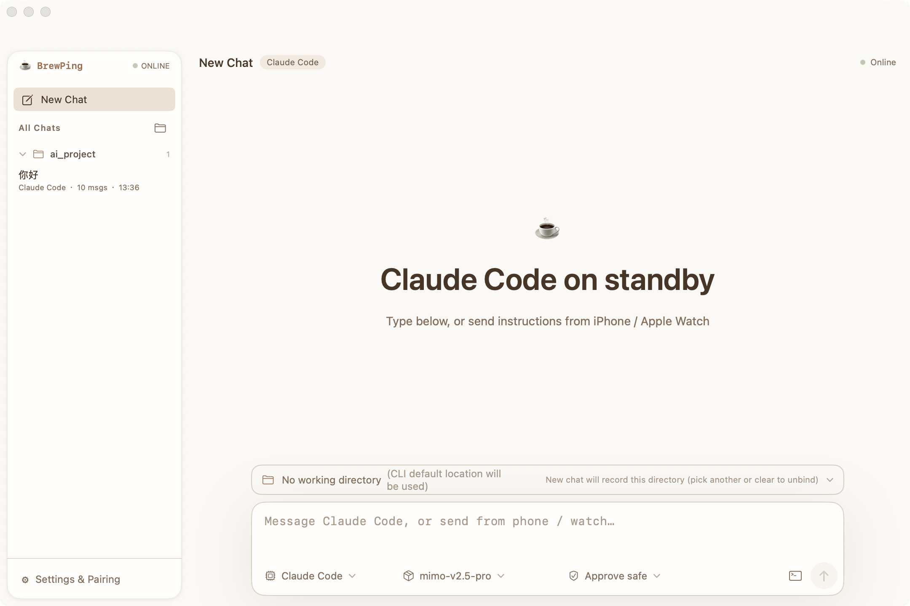
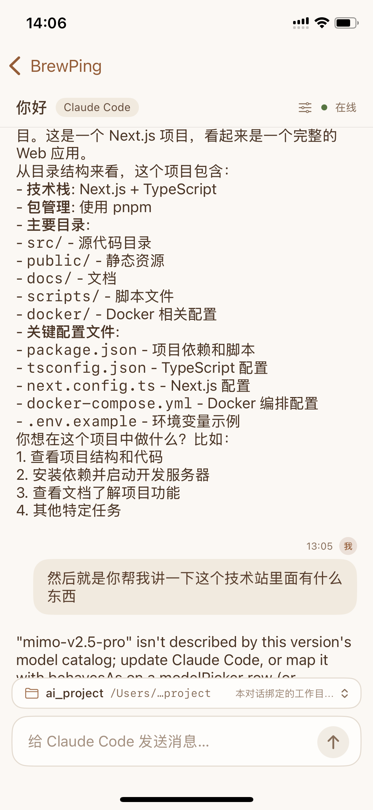

# BrewPing

> [English](README.md) | 简体中文

<p align="center">
  <a href="https://www.commitbrew.com">
    
  </a>
</p>

**用手机远程指挥你自己电脑上的编程 Agent。**

BrewPing 在你的 Mac 或 Windows 上跑一个小型桌面服务，驱动**你已经装好**的 CLI Agent。手机在局域网内配对一次，之后就能从 iPhone、Apple Watch 或 Android 发送指令、跟进进度，并在危险命令执行前批准或拒绝。

*你的 Agent、你的模型、你的电脑 —— 在同一个局域网里，用手机发指令。*

> **可用性：** macOS 与 Windows **已发布**（`v1.0.0`）· iOS / watchOS **已提交 App Review**（仅 TestFlight，尚无 App Store 商店页）· Android **已构建但未提交** Google Play · Wear OS 在仓库内、**尚未发布**。详见[可用性](#-可用性)。

<div align="center">

[](https://github.com/banmu123/BrewPing/actions/workflows/ci.yml)
[](LICENSE)
[](https://github.com/banmu123/BrewPing/stargazers)


**⚡ 快速开始（macOS，源码构建）：**

```bash
git clone https://github.com/banmu123/BrewPing.git && cd BrewPing && ./build-app.sh && open "build/BrewPing Desktop.app"
```

→ 菜单栏点 **Show Pairing Code**，用 iPhone App 扫码
· 或从 **[commitbrew.com](https://www.commitbrew.com/#download)** 下载已签名并公证的 DMG
· 完整步骤见 [🚀 快速开始](#-快速开始)

</div>

---

## 📸 截图

<p align="center">
  
  
</p>
<p align="center">
  <sub><b>macOS 桌面端</b> &nbsp;·&nbsp; <b>iPhone</b></sub>
</p>

## 🎯 适合谁用

- 你在 Mac 或 Windows 上跑 OpenCode / Claude Code / Codex CLI / pi，希望**离开那张桌子**也能让它开工、看进度、或在危险命令执行前拍板；
- 你希望用**手机或手表**完成这些：一只手、看一眼，不用开远程桌面；
- 你在意代码、提示词、Agent 输出**只留在自己的机器上** —— BrewPing 没有账号体系、没有 analytics，链路上也没有我们自己的服务器。

**不适合**：还没装上述 CLI Agent（BrewPing 是驱动它们，不是替代它们）；或者你想要的是跑在云端的托管式编程 Agent。

## 🤔 为什么用 BrewPing，而不是 SSH、远程桌面或云端 Agent？

| | SSH / 终端类 App | 远程桌面 | 云端 Agent | **BrewPing** |
|---|---|---|---|---|
| 懂 Agent 的界面（状态 / 转录 / 模型） | ✗ | ✗ | ✓ | ✓ |
| 手机 / 手表上好用 | 别扭 | 按屏幕缩放 | ✓ | ✓（原生 App） |
| 沿用你现有的 Agent 配置与登录 | ✓ | ✓ | ✗ | ✓（只读取，不替换） |
| 危险命令执行前有审批闸门 | ✗ | ✗ | 视产品而定 | ✓（safe / askAll / auto） |
| 代码与提示词留在自己机器 | ✓ | ✓ | 通常不行 | ✓（仅局域网） |
| 多 Agent + 模型远程切换 | ✗ | ✗ | ✗ | ✓ |

## ✨ 功能亮点

### 📲 在家里任何角落发指令

启动桌面服务、配对一次，之后就能从手机发指令。命令执行期间手机能看到 Agent 状态，结束时拿到输出 —— 不必守在键盘前。

### 🧩 继续用你已配置好的 Agent 和模型

BrewPing 不替换你的 Agent，也不接管它们的登录。它发现本机已安装的 CLI Agent，读出每个 Agent 当前配置的模型，让你远程切换当前 Agent 或模型。订阅、凭据、权限设置全部留在原处。

### 🛡️ 危险命令先批准再执行

命令在进入 Agent 之前就被检查。BrewPing 识别危险操作（`rm -rf`、`git reset --hard`、`curl | sh` 等）并挂起等你确认。三档模式：只拦危险命令 / 每条都确认 / 不确认直接跑。挂起的请求**超时即视为拒绝** —— 沉默永远不等于同意。

### ⌚ iPhone、Apple Watch 与 Android

两个手机端流程一致：在同一个 Wi-Fi 里自动发现电脑，或手动填 host 与 port；扫二维码或手输 6 位配对码完成配对；之后浏览对话、发指令、切 Agent 与模型、批准命令。手表端支持语音口述指令、滑动切换 Agent 与模型，不用掏手机就能看回复。

### 📁 对话与工作目录绑在一起

对话按绑定目录分组展示，可置顶、归档、随时切回；把工作目录绑到某条对话上，文件操作就发生在对话所在的目录；Agent、模型、授权档位都是**对话级**设置。

### 🔍 自动发现你的电脑

Bonjour/mDNS 自动发现同一 Wi-Fi 下的电脑，不必手输 IP。若网络拦了多播（AP 隔离、访客网络），可以手动填 host:port —— 界面会明确告诉你该检查什么。

### 🖥️ 还有这些

- **多设备** —— 配对多台电脑，在设备栏里直接切换。
- **应用内切换语言** —— 英文 / 简体中文，切换立即生效，不用重启 App。
- **Markdown 转录** —— Agent 输出按 Markdown 渲染，长回复也能读。
- **只在局域网内** —— 无账号、无 analytics、无第三方 SDK；指令与输出只在你的手机和你自己的电脑之间流动。
- **Demo 设备（iOS）** —— 没有电脑也能完整体验整套流程。

## 🏗️ 架构

```
┌──────────────┐    HTTP API     ┌─────────────────────────┐
│     手机     │ ◄────────────►  │   BrewPing Desktop      │
│ iOS / Android│    同一 Wi-Fi   │  macOS 菜单栏 + 窗口     │
└──────┬───────┘   Bonjour 发现   │  或 Windows (Tauri)     │
       │                          └───────────┬─────────────┘
       │ WatchConnectivity                    │ PTY / CLI
┌──────┴───────┐                  ┌──────────┴─────────────┐
│ Apple Watch  │                  │  opencode · claude     │
│  (watchOS)   │                  │  codex · pi            │
└──────────────┘                  └────────────────────────┘
```

- **桌面服务** —— Swift 核心（`Sources/App`、`Agents`、`PTY`、`Session`、`Protocol`）在局域网内提供 HTTP API、托管 Agent 进程、并在命令进入 Agent 前做审批检查。Windows 端用 Rust（Tauri 2 + axum）实现同一套接口，客户端完全共用。
- **客户端** —— iOS / watchOS（SwiftUI）、Android（Jetpack Compose）、以及 CLI（`swift run BrewPing …`）。客户端之间不互相通信，也不会连你没配对过的机器。
- **鉴权** —— 一次性 6 位配对码换取长期 token；所有 `/api/*` 请求带 `Authorization: Bearer <token>`，写操作额外带 `X-BrewPing-Timestamp` 与 `X-BrewPing-Nonce`（120 秒窗口、防重放）。

## 📦 可用性

现在能装到什么、什么还在路上：

| 端 | 状态 | 怎么获取 |
|---|---|---|
| macOS 桌面端 | **已发布**（`v1.0.0`） | [GitHub Release](https://github.com/banmu123/BrewPing/releases/tag/v1.0.0) 的签名 + 公证 DMG，或源码构建 |
| Windows 桌面端 | **已发布**（`v1.0.0`） | 同一个 Release 的 `setup.exe` / `.msi`，或 `npm run tauri dev` |
| iPhone / Apple Watch | **已提交 App Review** —— 尚未公开发布 | 在 Apple 通过前，用 Xcode 源码构建 |
| Android 手机端 | **构建就绪，尚未提交** Google Play | `cd Android && ./gradlew assembleDebug` |
| Wear OS 手表端 | **已在仓库内，尚未发布** | 源码构建；未上任何商店 |

BrewPing 只发布**局域网**能力 —— 没有托管服务，也没有官方公网中继，因此所有客户端都只会连你配对过的那台电脑。

## 🚀 快速开始

### 🍎 macOS 桌面端（源码构建）

```bash
git clone https://github.com/banmu123/BrewPing.git
cd BrewPing
./build-app.sh                          # 产出 build/BrewPing Desktop.app
open "build/BrewPing Desktop.app"
```

想要现成的：官网 [commitbrew.com](https://www.commitbrew.com/#download) 的 DMG 已做 Developer ID 签名、公证与 staple，双击即开，不会有 Gatekeeper 提示。

### 🪟 Windows 桌面端（Tauri 2 + axum）

```bash
cd Sources/BrewPingwinDesktop
npm install
npm run tauri dev
```

### 📱 iPhone / Apple Watch

```bash
open ios/BrewPing.xcodeproj             # 选好 Team 后直接 Run
```

iOS 端使用 bundle ID `com.brewping.ios` 与 `com.brewping.ios.watchkitapp`。

### 🤖 Android

```bash
cd Android && ./gradlew assembleDebug   # Windows: gradlew.bat assembleDebug
```

### 🔗 配对手机

1. 桌面端菜单栏点 **Show Pairing Code**，出现 6 位配对码（同时显示二维码）；
2. 手机扫码，或点 **Add Device** 手动输入配对码；
3. 两端必须处于**同一个局域网**。BrewPing 没有公网中继，也永远不会连你没配置过的机器。

配对码一次性有效、10 分钟过期。iOS 端 token 存在 Keychain，桌面端存在 `~/.brewping/pairing.json`（权限 `0600`）。

### ⌨️ 从命令行使用

```bash
swift run BrewPing start                        # 在 PTY 里启动一个 OpenCode 会话
swift run BrewPing status                       # 查看当前会话状态
swift run BrewPing send "修一下失败的测试"        # 给会话发一条消息
swift run BrewPing attach                       # 接入正在运行的会话（Ctrl+D 断开）
swift run BrewPing stop                         # 结束会话
```

## 🧠 支持的 Agent

BrewPing 驱动的是**你电脑上已经装好**的 CLI Agent。产品名称与商标归各自所有者（见 [商标声明](#-商标声明)）。

| Agent | 模式 | 命令 | 读取的配置 |
|-------|------|------|-----------|
| OpenCode | 会话（交互式 PTY） | `opencode` | `~/.config/opencode/opencode.json` |
| Claude Code | 无头（一次性） | `claude` | `~/.claude/settings.json` |
| Codex CLI | 无头（一次性） | `codex` | `~/.codex/config.toml` |
| pi | 无头（一次性） | `pi` | `~/.pi/agent/settings.json` + `~/.pi/agent/models.json` |

按需安装：

```bash
# OpenCode
curl -fsSL https://get.opencode.ai | sh

# Claude Code
npm install -g @anthropic-ai/claude-code

# Codex CLI
npm install -g @openai/codex

# pi
npm install -g @earendil-works/pi-coding-agent
```

## 🔌 HTTP API

除 `POST /api/pair` 与 `GET /api/status` 外，所有接口都要求 `Authorization: Bearer <token>`；写操作额外要求 `X-BrewPing-Timestamp` 与 `X-BrewPing-Nonce`。

| Method | Path | 说明 |
|--------|------|------|
| POST | `/api/pair` | 用 6 位配对码换取长期 token（公开） |
| GET | `/api/status` | 设备状态、只读健康检查（公开） |
| GET | `/api/protocol/state` | 协议状态快照 |
| GET | `/api/agents` | 已安装的 Agent |
| POST | `/api/agents/default` | 设置默认 Agent |
| POST | `/api/agents/:id/switch` | 切换当前 Agent |
| GET | `/api/agents/:id/models` | 该 Agent 配置的模型（providers → models） |
| POST | `/api/agents/models/default` | 设置默认模型 |
| POST | `/api/message` | 发送消息（可选 `commandId` = 客户端幂等键） |
| GET | `/api/message/:id` | 单条命令状态，含服务端权威执行阶段（`run.phase`） |
| POST | `/api/session/start` | 启动会话 |
| POST | `/api/session/stop` | 结束会话 |
| GET / POST | `/api/approvals/mode` | 读取或修改授权档位 |
| GET | `/api/approvals` | 待确认的请求 |
| POST | `/api/approvals/:id` | `approve` / `deny` / `always_approve` |
| GET / POST | `/api/conversations` | 列出或创建对话 |
| GET / PATCH / DELETE | `/api/conversations/:id` | 读取、修改或删除单条对话 |
| POST | `/api/conversations/:id/activate` | 激活某条对话 |
| GET | `/api/folders/roots` | 工作目录选择器的根列表 |
| GET | `/api/folders?path=` | 浏览子目录（只返回目录） |
| POST | `/api/agents/workdir` | 设置或清除某个 Agent 的默认工作目录 |
| POST | `/api/discovery/refresh` | 刷新局域网发现 |

`run.phase` 由桌面端根据命令的真实状态与最后输出时刻推导：
`queued` / `thinking` / `streaming` / `stalled` / `completed` / `failed`。其中 `stalled` 由桌面端判定（30 秒没有新输出）—— 客户端只展示，绝不自己猜。

`POST /api/message` 接受可选的客户端 `commandId`：网络超时后重试时带**同一个值**，桌面端会返回既有命令而不是重复执行。它与传输层的 `X-BrewPing-Nonce`（防重放）是两回事。

## ⚙️ 配置

BrewPing 的状态都在 `~/.brewping/`：

- `device.json` —— 设备身份（device ID、名称）
- `pairing.json` —— 配对 token 与临时配对码（权限 `0600`）
- `approval.json` —— 全局授权档位与 always-allow 规则（权限 `0600`）
- `config.json` —— Agent 配置（默认 Agent、模型偏好）
- `session.json` —— 当前会话状态

## 🔒 隐私与安全

- **没有账号、没有 analytics、没有第三方 SDK、没有我们运营的服务器。** 你发的指令、Agent 返回的输出、以及被转写的语音，只在你的手机（或手表）与你配对的那台电脑之间流动。完整说明见[隐私政策](docs/privacy.html)。
- **Token 处理** —— 配对码一次性、10 分钟过期；换来的 token 在桌面端以 `0600` 权限存储，iOS 端存在 Keychain。写请求带时间戳与 nonce（120 秒防重放窗口）。
- **审批闸门的边界是有意收窄的** —— 它在命令**进入 Agent 之前**拦截，因此 Agent 自己后续派生的 shell 命令不在本版本覆盖范围内。请把它当作针对**你的指令**的安全网，而不是给 Agent 用的沙箱。
- **不打包、不再分发任何第三方 Agent。** BrewPing 只检测并调用你自己安装的 CLI 工具；上面的安装命令指向各家自己的分发渠道。

## 🧪 测试与 CI

- **Swift 单元测试** —— `swift test` 共 **66 个用例**，覆盖四个厂商原生配置模块（Claude Code / Codex / OpenCode / pi 的合并与写回不变量）、对话执行状态机，以及 HTTP 执行阶段的推导规则 —— 配置被静默改坏、「不知道是否卡住」最容易藏身的就是这些地方。
- **Android 单元测试** —— `:core` 与 `:app` 共 **83 个 JVM 单测**，不需要设备（`cd Android && ./gradlew test`）；CI 另外构建手机端与 Wear OS 模块。
- **GitHub Actions** —— [`.github/workflows/ci.yml`](.github/workflows/ci.yml) 在每次 push / PR 上跑 Swift 核心的构建与测试、以关闭签名的方式编译 iOS + watchOS 目标，并运行 Windows 与 Android 测试；另有每日定时运行以捕捉 runner 工具链漂移。
- **Windows 端** —— Rust 侧有独立的 **318 例** `cargo test --locked`（`Sources/BrewPingwinDesktop/src-tauri`）。
- **发布** —— 推 `v*` tag 触发 [`.github/workflows/release-mac.yml`](.github/workflows/release-mac.yml)：构建 universal 二进制 → Developer ID 签名 → 公证 → staple → 把 DMG 挂到 GitHub Release。该 workflow 依赖仓库中**未配置**的 Apple 签名 secrets，因此 `v1.0.0` 的 macOS 包由维护者在本地构建后手工挂载（见[项目状态](docs/PROJECT_STATUS.md)）。

## 📋 环境要求

| 平台 | 要求 |
|---|---|
| macOS 桌面端 | macOS 13.0 或更高（产出 universal 二进制：Apple Silicon + Intel） |
| Windows 桌面端 | Windows 10/11 + WebView2（Tauri 2） |
| iPhone | iOS 17.0 或更高 |
| Apple Watch | watchOS 11.6 或更高（与 iPhone App 配对使用） |
| Android | Android 8.0 或更高（minSdk 26） |
| Wear OS | Wear OS 3.0 或更高（minSdk 30）—— 模块已在仓库内，但**尚未发布** |
| 网络 | 手机/手表与电脑处于**同一局域网** |
| Agent | 电脑上至少装了 OpenCode / Claude Code / Codex CLI / pi 之一 |

## 📚 文档

- **[隐私政策](docs/privacy.html)** —— BrewPing 碰什么、不碰什么
- **[iOS 端结构与模块划分](docs/BrewPing-iOS端结构与模块划分.md)** —— iPhone 端布局与状态流
- **[Windows 端多对话管理实现方案](docs/BrewPing-Windows端多对话管理实现方案.md)** —— 桌面端对话模型
- **[Provider 管理迁移方案](docs/BrewPing-Provider管理-Lody新建Provider迁移方案.md)** —— 配置内部实现
- **[获取文件夹落地方案](docs/BrewPing-获取文件夹-Windows落地方案.md)** —— 工作目录绑定
- **[App Store 提审前自查](docs/AppStore-PreSubmission-Review.md)** —— iOS 端进入 App Review 时跑过的审核清单
- **[项目状态](docs/PROJECT_STATUS.md)** —— 平台、测试数量、维护流程与已知限制
- **[商标](TRADEMARKS.md)** —— 仅用于说明兼容性的第三方名称
- **[中继原型](experimental/relay-server/README.md)** —— 实验性、**未接入任何客户端**，不在产品安全边界内

## 🏗️ 技术栈

| 层 | 技术 |
|----|------|
| 核心服务 | Swift 5.9（SwiftPM），**零第三方 Swift 依赖** |
| macOS 桌面端 | SwiftUI + AppKit（窗口 + 菜单栏），Hardened Runtime，已公证 |
| Windows 桌面端 | Tauri 2 + axum + React 19 + Vite + Tailwind CSS 4 |
| iOS / watchOS | SwiftUI、WatchConnectivity |
| Android | Kotlin + Jetpack Compose（minSdk 26、JDK 17） |
| 传输 | 局域网 HTTP、Bonjour/mDNS 发现、Bearer token + nonce |
| 中继原型（实验性、未发布） | TypeScript + ws + express —— 停在 `experimental/`，没有任何客户端连接它 |

## 📁 项目结构

```
Sources/
├── App/                  # HTTP API、路由、配对存储、审批闸门、对话
├── Agents/               # Agent 发现 + OpenCode / Claude Code / Codex / pi 驱动
├── PTY/                  # 交互式 Agent 的伪终端处理
├── Session/              # 会话生命周期
├── Protocol/             # 各端共用的通信协议
├── BrewPing/             # CLI 入口（start / status / send / attach / stop）
├── BrewPingDesktop/      # macOS SwiftUI App（窗口 + 菜单栏）
└── BrewPingwinDesktop/   # Windows 桌面端（Tauri 2 + axum + React）
ios/
├── BrewPing/             # iPhone App
└── Watch/                # Apple Watch App
Android/                  # Android 手机端 + Wear OS 模块（Jetpack Compose）
experimental/
└── relay-server/         # 停放中的 TypeScript 原型 —— 不属于已发布产品
Scripts/                  # 打包脚本（build-mac-app.sh）+ DMG 用 entitlements/Info.plist
docs/                     # 设计文档 + 隐私政策
logo/                     # 应用图标与 logo
```

## 🚧 局域网之外

BrewPing 只发布**局域网**能力：没有官方公网中继、没有托管服务，仓库里也没有任何东西会把你的流量代理到公网。

`experimental/relay-server/` 是一个**停放中的原型**：它不属于已发布产品，没有任何客户端连接它，没有鉴权，并且会把中转的 payload 写进日志。不要把它部署到公网或任何不可信网络（详见其 README）。它只作参考保留 —— 不在产品链路上，也不在「即将发布」的路线里。

如果你想从另一个网络访问自己的电脑，那是**你自己那一侧的网络问题** —— 比如用 Tailscale、WireGuard 这类 VPN 组网解决。BrewPing 不提供、不配置，也不背书这套方案。

## 🤝 参与贡献

欢迎提 issue 与 PR —— 构建命令、CI 会跑什么、以及仓库约定见 [CONTRIBUTING.md](CONTRIBUTING.md)。安全问题请走 [SECURITY.md](SECURITY.md)。

## ⚠️ 商标声明

OpenCode、Claude、Claude Code、Codex、pi 等名称归各自所有者所有。BrewPing 与这些厂商**没有任何隶属、赞助或背书关系**；提及这些名称仅用于说明兼容性，逐个名称的说明见 **[TRADEMARKS.md](TRADEMARKS.md)**。

BrewPing 只连接**你自己配置过**、且位于你自己局域网内的设备。它不会连接第三方设备，也不提供公网中继。

## 📄 许可证

[MIT](LICENSE)。

BrewPing 不打包、不再分发任何第三方 Agent，只检测并调用你本机已安装的命令行工具（见[商标声明](#-商标声明)）。

## 🙏 致谢

- [Swift](https://www.swift.org/) + SwiftUI / AppKit —— 核心服务与 macOS 端
- [Tauri](https://tauri.app/) —— Windows 桌面端外壳
- [Jetpack Compose](https://developer.android.com/jetpack/compose) —— Android 端
- [shields.io](https://shields.io/) —— README 徽章
- OpenCode、Claude Code、Codex CLI、pi —— BrewPing 驱动的 Agent（非官方，见商标声明）
